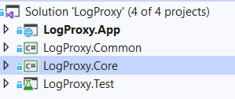
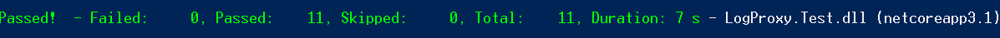

# Log Proxy API
### Log Proxy API structure

The solution as you can seen in the above picture, contain 4 projects.

* LogProxy.App: A Web API project contains the hosting process.
* LogProxy.Common : A Class Library project contains common stuff among other projects.
* LogProxy.Core : A Class Library project contains routing to target.
* LogProxy.Test : A test project that test whole main process.

This API has written based on .NET Core 3.1, the main project is `LogProxy.App`, the whole application process has been implemented using middlewares.
There are two main middlewares, one for handling the Authentication (`BasicAuthMiddleware`) and the other one (`ProxyMiddleware`) is for Proxy logic.

### How to Run
First of all you can running all the test by moving into the `src` folder and executing the following command

`dotnet test`

you can see the test execution as follows.

after that you can run the Log Proxy API using `docker`, by moving into `src` folder and running following commands using CMD

`docker build -t logproxy-img .`

`docker run -d -p 5050:80 --name logproxy-app logproxy-img`

now the Proxy is running on 5050 port and able to accept and requests.
