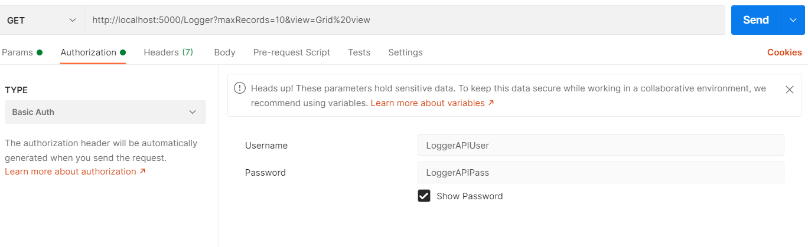
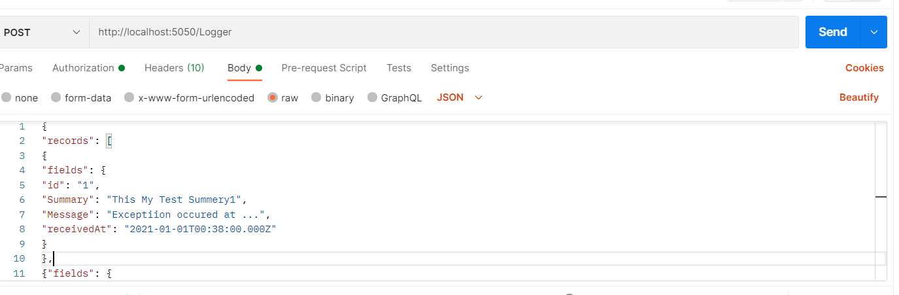

# Log Proxy API
### Log Proxy API structure

The solution as you can see in the above picture contains 4 projects.

* LogProxy.App: A Web API project contains the hosting process.
* LogProxy.Common : A Class Library project contains common stuff among other projects.
* LogProxy.Core : A Class Library project contains routing to target.
* LogProxy.Test : A test project that tests the whole main process.

This API has written based on .NET Core 3.1, the main project is `LogProxy.App`, the whole application process has been implemented using middlewares.
There are two main middlewares, one for handling the Authentication (`BasicAuthMiddleware`) and the other one (`ProxyMiddleware`) is for Proxy logic.

### How to Run
First of all, you can run all the test by moving into the `src` folder and executing the following command

`dotnet test`

you can see the test execution as follows.

after that, you can run the Log Proxy API using `docker`, by moving into the `src` folder and running the following commands using CMD

`docker build -t logproxy-img .`

`docker run -d -p 5050:80 --name logproxy-app logproxy-img`

now the Proxy is running on 5050 port and able to accept and requests.

### Consuming the API

In order to use the API, you can use [postman](https://www.postman.com/downloads/), at first you should be authenticated using `basic Auth` as you can see in the following picture
use `Username: LoggerAPIUser and Password : LoggerAPIPass`

for sending `GET` request you can enter the URL as follows and you and see the response.

`http://localhost:5050/Logger?maxRecords=10&view=Grid%20view`

also for sending `POST` request, you can send to this URL, also prepared authentication like above.

`http://localhost:5050/Logger`

note that for sending post request you should attach JSON data like the following picture and get the correct result.

